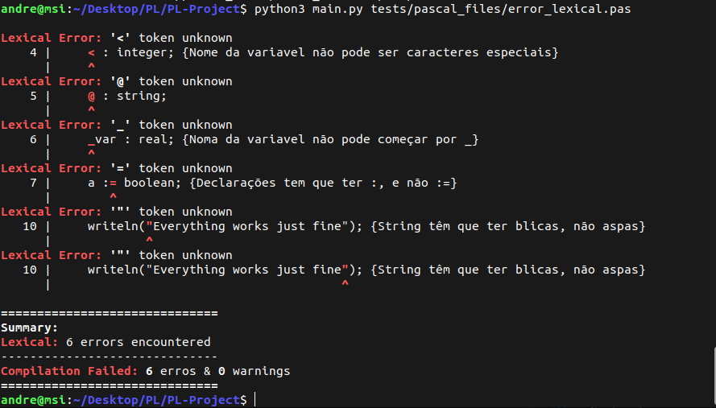
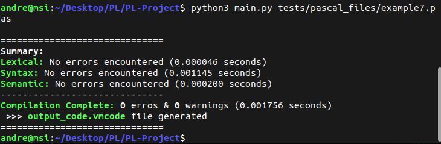
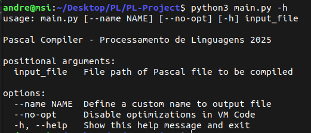

# Relatório

- **Unidade Curricular :** Processamento de Linguagens
- **Ano :** 2024/2025
- **Curso :** Licenciatura em Engenharia Informática
- **Identificação do grupo :** Grupo 03
- **Alunos :**  

  
André Filipe Barros Campos - a104618

  
Beatriz Carvalho Peixoto - a104170

  
Sara Azevedo Lopes - a104179

## 1. Introdução

O objetivo deste trabalho prático da Unidade Curricular **Processamento de Linguagens** (PL) é desenvolver um compilador, feito em python, que consiga analisar, interpretar e traduzir código Pascal para código máquina da [Virtual Machine](https://ewvm.epl.di.uminho.pt/) disponibilizada aos alunos.

Na realização deste projeto houveram 4 etapas do projeto:
- Análise Léxica
- Análise Sintática
- Análise Semântica
- Geração de Código

Estas etapas serão explicadas de seguida

## 2. Análise Léxica

Nesta etapa, o código em Pascal, que é um texto, tem que ser transformado num conjunto de **tokens** para que possam ser utilizados na próxima etapa.
A análise léxica encontra-se no ficheiro [lex.py](lexical/lex.py) e recorremos ao **ply.lex**

Usamos dois estados possíveis:
- **Default :** estado para tratar das declarações do código Pascal
- **InBlock :** estado para tratar das instruções do código Pascal

O motivo para usarmos esses dois estados é para que certos tokens não sejam considerados palavras reservadas, e sim como outros tokens, quando estamos a tratar de instruções, e não de declarações
_Exemplo: a palavra "function" é vista como palavra reservada quando são declarações, e é considerada nome de variável quando são instruções_

Os tokens considerados foram:
- **BEGIN** **:** palavra reservada "begin"
- **END** **:** palavra reservada "end"
- **ID** **:** nome de uma variável
- **NUMBER** **:** número inteiro
- **NUMBERREAL** **:** número décimal
- **PROGRAM** _(Estado Default)_ **:** palavra reservada "program"
- **VAR** _(Estado Default)_ **:** palavra reservada "var"
- **DATATYPE** _(Estado Default)_ **:** palavras reservadas em relação aos tipos de dados:
    - integer
    - real
    - char
    - string
    - boolean
- **ARRAY** _(Estado Default)_ **:** palavra reservada "array"
- **RANGEOP** _(Estado Default)_ **:** operador reservado para declarações de arrays ".."
- **OF** _(Estado Default)_ **:** palavra reservada para declarações de arrays "of"
- **FUNCTION** _(Estado Default)_ **:** palavra reservada "function"
- **PROCEDURE** _(Estado Default)_ **:** palavra reservada "procedure"
- **STRING** _(Estado InBlock)_ **:** strings
- **CHAR** _(Estado InBlock)_ **:** caracteres, ou seja, strings com 1 único caracter
- **WALRUS** _(Estado InBlock)_ **:** Operador de atribuição de valor ":="
- **ARITOP** _(Estado InBlock)_ **:** Operadores aritméticos com maior prioridade:
    - Multiplicação (*)
    - Divisão (/ ou div)
    - Resto da Divisão (mod)
- **ARITOP2** _(Estado InBlock)_ **:** Operadores aritméticos com menor prioridade:
    - Adição (+)
    - Subtração (-)
- **FOR** _(Estado InBlock)_ **:** palavra reservada "for"
- **TO** _(Estado InBlock)_ **:** palavra reservada "to"
- **DOWNTO** _(Estado InBlock)_ **:** palavra reservada "downto"
- **DO** _(Estado InBlock)_ **:** palavra reservada "do"
- **RELAOP** _(Estado InBlock)_ **:** Operadores relacionais:
    - Igual (=)
    - Diferente (<>)
    - Maior ou igual (>=)
    - Menor ou igual (<=)
    - Menor (<)
    - Maior (>)
    - Incluido (in)
- **LOGICOP1** _(Estado InBlock)_ **:** Operador lógico com maior prioridade (not)
- **LOGICOP2** _(Estado InBlock)_ **:** Operador lógico com prioridade moderada (and)
- **LOGICOP3** _(Estado InBlock)_ **:** Operadores lógicos com menor prioridade (or xor)
- **WHILE** _(Estado InBlock)_ **:** palavra reservada "while"
- **IF** _(Estado InBlock)_ **:** palavra reservada "if"
- **ELSE** _(Estado InBlock)_ **:** palavra reservada "else"
- **THEN** _(Estado InBlock)_ **:** palavra reservada "then"
- **LOGICVALUE** _(Estado InBlock)_ **:** valor booleano (true|false)
- **COMMENT** **:** comentários
- **Literais** **:**
    - (
    - )
    - [
    - ]
    - .
    - ;
    - ,
    - :

## 3. Análise Sintática

Nesta etapa, o analisar sintático utiliza todos os tokens obtidos no texto em pascal para verificar se estes tokens seguem uma certa **gramática**, gramática esta a ver com a estrutura de código Pascal.
A análise sintática encontra-se no ficheiro [syn.py](syntax/syn.py) e recorremos ao **ply.yacc**

Gramática completa:
```
init : PROGRAM ID ';' vars_declaration_global has_funcproc main_code

has_funcproc : funcproc_declaration_list_init vars_declaration_local
             |

vars_declaration_global : VAR vars_declaration_list
                        |

vars_declaration_local : VAR vars_declaration_list
                       |

vars_declaration_list : vars_declaration_list declaration
                      | declaration

declaration : declarations_name_list ':' data_type ';'
declarations_name_list : declarations_name_list ',' ID
                       | ID

data_type : DATATYPE
          | ARRAY '[' NUMBER RANGEOP NUMBER ']' OF DATATYPE

funcproc_declaration_list_init : funcproc_declaration_list
funcproc_declaration_list : funcproc_declaration_list funcproc_declaration
                          | funcproc_declaration

funcproc_declaration : FUNCTION ID '(' funcproc_args_declaration ')' ':' data_type ';' vars_declaration_local code_block ';'
                     | PROCEDURE ID '(' funcproc_args_declaration ')' ';' vars_declaration_local code_block ';'
funcproc_args_declaration : funcproc_args_declaration_continue
                          |
funcproc_args_declaration_continue : funcproc_args_declaration_continue ',' ID ':' data_type
                                   | ID ':' data_type

main_code : code_block '.'
code_block : BEGIN instruction_list END

instruction_list : instruction_list instruction ';'
                 |
mini_code_block : instruction
                | code_block

instruction : instruction_funcproc
            | instruction_if
            | instruction_for
            | instruction_while
            | instruction_walrus

instruction_funcproc : ID instruction_funcproc_args
instruction_funcproc_args : '(' funcproc_args ')'
funcproc_args : funcproc_args_continue
              |
funcproc_args_continue : funcproc_args_continue ',' expression
                       | expression
                       
instruction_if : IF expression THEN mini_code_block ELSE mini_code_block
               | IF expression THEN mini_code_block %prec IFX

instruction_for : FOR instruction_walrus instruction_for_final DO mini_code_block
instruction_for_final : TO expression
                      | DOWNTO expression

instruction_while : WHILE expression DO mini_code_block

instruction_walrus : expression WALRUS expression
                   | get_array_index_value WALRUS expression

expression : expression ARITOP1 expression
           | expression ARITOP2 expression
           | expression RELAOP expression
           | expression LOGICOP2 expression
           | expression LOGICOP3 expression
           | LOGICOP1 expression
           | '(' expression ')'
           | NUMBER
           | NUMBERREAL
           | STRING
           | CHAR
           | LOGICVALUE
           | ID
           | instruction_funcproc
           | get_array_index_value

get_array_index_value : ID '[' expression ']'
```

Como usamos o ply.yacc, as regras contêm recursividade à esquerda, pois é mais eficiente para algoritmos BottomUp, como é o caso do ply.yacc.  
Para além disso, usamos o operador **precedence** para definir prioridades nas regras, aplicado principalmente na regra **expression**.  

Nesta fase, o analisador sintático gera uma **Abstract Syntax Tree**, que será usada na análise semântica.  
Os tipos de nodos desta AST são:

Regra - **init**  
_Nodo raíz da árvore_
```
"type" : "PROGRAM"
"program_name" : Nome do programa
"global_vars" : Lista com as variáveis globais
"funcproc_list" : Lista com as declarações e definições das funções/procedimentos
"local_vars" : Lista com as variáveis locais
"code_block" : Bloco de Código
```

Regra - **vars_declaration_global**  
_Lista das declarações de variáveis globais_
```
"type" : "VARS_GLOBAL"
"var_global_list" : Lista com as declarações de variaveis
```

Regra - **vars_declaration_local**  
_Lista das declarações de variáveis locais_
```
"type" : "VARS_LOCAL"
"var_global_list" : Lista com as declarações de variaveis
```

Regra - **declaration**  
_Declaração de variaveis do mesmo tipo de dados_
```
"type" : "VAR_DECL"
"data_type" : Tipo de dados da variável
"var_names_list" : Lista do nome das variáveis de um certo tipo de dados
```

Regra - **funcproc_declaration_list_init**  
_Lista com todas as declarações e definições de funções e procedimentos_
```
"type" : "FUNCPROC"
"funcproc_list" : Lista com as declarações e definições de funções/procedimentos
```

Regra - **funcproc_declaration** (Função)  
_Declaração e definição de uma função_
```
"type" : "FUNCTION"
"is_default" : Indica se é uma função pré-definida
"function_name" : Nome da função
"return_value" : Tipo de dados do retorno
"args" : Lista dos argumentos da função
"local_vars" : Lista com as variáveis locais da função
"function_code" : Bloco de código que contém a definição da função
```

Regra - **funcproc_declaration** (Procedimento)  
_Declaração e definição de um procedimento_
```
"type" : "PROCEDURE"
"is_default" : Indica se é um procedimento pré-definido
"procedure_name" : Nome do procedimento
"args" : Lista dos argumentos do procedimento
"local_vars" : Lista com as variáveis locais do procedimento
"procedure_code" : Bloco de código que contém a definição do procedimento
```

Regra - **funcproc_args_declaration**  
_Lista de declarações dos argumentos de uma função/procedimento_
```
"type" : "FUNCPROC_DECL_ARGS_LIST"
"args_list" : Lista de declarações dos argumentos
```

Regra - **funcproc_args_declaration_continue**  
_Declaração de um argumento de uma função/procedimento_
```
"type" : "FUNCPROC_DECL_ARG"
"var_name" : Nome do argumento
"data_type" : Tipo de dados do argumento
```

Regra - **code_block**  
_Bloco de instruções_
```
"type" : "CODE_BLOCK"
"instructions_list" : Lista de instruções
```

Regra - **instruction_funcproc**  
_Instrução de invocação de função/procedimento_
```
"type" : "INSTRUCTION_FUNCPROC"
"funcproc_name" : Nome da função/procedimento invocada
"funcproc_args" : Argumentos para a invocação da função/procedimento
```

Regra - **funcproc_args**  
_Lista de argumentos para a invocação de função/procedimento_
```
"type" : "FUNCPROC_ARGS"
"args_list" : Lista de argumentos
```

Regra - **instruction_if**  
_Instrução de if e else_
```
"type" : "INSTRUCTION_IF_ELSE"
"condition" : Condição
"body_if" : Instruções a serem executadas caso a condição seja verdadeira
"body_else" : Instruções a serem executadas caso a condição seja falta (Pode não existir caso seja uma instrução de if sem else)
```

Regra - **instruction_for**  
_Instrução de ciclo for_
```
"type" : "INSTRUCTION_FOR"
"var_control" : Instrução para atribuição de valor para a variável de controlo do cilo
"condition" : Condição do ciclo for
"body" : Lista de instruções a serem executadas no ciclo
```

Regra - **instruction_for_final_to** (Condição do ciclo for)  
_Condição do ciclo for "to"_
```
"type" : "INSTRUCTION_FOR_TO"
"value" : Valor final do ciclo
```

Regra - **instruction_for_final_downto** (Condição do ciclo for)  
_Condição do ciclo for "downto"_
```
"type" : "INSTRUCTION_FOR_DOWNTO"
"value" : Valor final do ciclo
```

Regra - **instruction_while**  
_Instrução de ciclo while_
```
"type" : "INSTRUCTION_WHILE"
"condition" : Condição do ciclo while
"body" : Lista de instruções a serem executadas no ciclo
```

Regra - **instruction_walrus**  
_Instrução de atribuição de valor a uma variável_
```
"type" : "INSTRUCTION_WALRUS"
"var" : Variável que pretendemos atribuir um valor
"value" : Valor a ser atribuído à variável
```

Regra - **expression_operations**  
_Operações binárias_
```
"type" : "OPERATION_BINARY"
"operator" : Operador binário
"value_1" : 1º valor
"value_2" : 2º valor
```

Regra - **expression_operations_not**  
_Operações unárias (Só o operador "not" é operador unário nesta gramática)_
```
"type" : "OPERATION_UNARY"
"operator" : Operador unário
"value" : Valor
```

Regra - **expression_value_number**  
_Número inteiro estático_
```
"type" : "VALUE_NUMBER"
"value" : Número inteiro
```

Regra - **expression_value_number_real**  
_Número decimal estático_
```
"type" : "VALUE_NUMBER_REAL"
"value" : Número decimal
```

Regra - **expression_value_string**  
_String estática_
```
"type" : "VALUE_STRING"
"value" : String
```

Regra - **expression_value_char**  
_Caractér estático_
```
"type" : "VALUE_CHAR"
"value" : Caractér
```

Regra - **expression_value_boolean**  
_Valor lógico estático_
```
"type" : "VALUE_BOOLEAN"
"value" : Valor lógico
```

Regra - **expression_value_variable**  
_Variável_
```
"type" : "VALUE_VAR"
"value" : Nome da variável
```

Regra - **get_array_index_value**  
_Obter elemento num índice de um array_
```
"type" : "ARRAY_INDEX"
"array_name" : Nome do array
"index" : Índice
```

## 4. Análise Semântica

Nesta etapa, após obtermos a árvore AST, vamos analisar a árvore para verificar que ela é semanticamente válida.  
Para além disso, a análise semântica efetua alterações na árvore para que seja utilizada na Geração de Código.
A análise semântica encontra-se no ficheiro [semantic.py](semantic/semantic.py) e usamos os objetos declarados e definidos no ficheiro [sem_classes.py](semantic/sem_classes.py)

No inicio da análise semântica, é gerada uma **tabela**, onde nela encontram-se as seguintes informações:
- **table** : Tabela que contém **objetos semânticos** _(Será explicado brevemente)_
- **global_var_counter** : Contador de variáveis globais e que será usado para dar identificadores numéricos únicos às variáveis globais
- **local_var_counter** : Contador de variáveis locais e que será usado para dar identificadores numéricos únicos às variáveis locais
- **funcproc_counter** : Contador de funções/procedimentos e que será usado para dar identificadores numéricos únicos às funções/procedimentos
- **current_table** : Indica em qual escopo a análise encontra-se. É útil para saber quais as variáveis locais devem ser consideradas
- **allow_opt** : Indica se é permitido efetuar otimizações

Depois da geração da tabela, é injetado no campo **table** objetos semânticos que referenciam funções e procedimentos pré-definidos, tais como:
- **\_func** : Procedimento que será visto como um procedimento onde todas as instruções principais do código Pascal encontram-se. O nome **\_func** começa com _underline_, impossibilitando que haja uma função/procedimento com o mesmo nome.
- **write** : Procedimento de escrita para o _STANDARD\_OUTPUT_
- **writeln** : Procedimento de escrita para o _STANDARD\_OUTPUT_ que termina com um _newline_
- **read** : Procedimento de leitura do _STANDARD\_INPUT_ e atribuir o seu valor às variáveis
- **readln** : Procedimento de leitura do _STANDARD\_INPUT_ e atribuir o seu valor às variáveis e termina com um _newline_
- **length** : Função que recebe um argumento e retorna um número inteiro

Como mencionado acima, a análise semântica necessita de **objetos semânticos**, estes objetos são:
1. **SemProgram :** Objeto que contém a declaração de "program"
    - **name :** Nome do programa
2. **SemDatatype :** Objeto que contém um Tipo de Dados
    - **datatype :** Tipo do Tipo de Dados
    - **is_array :** Indica se o Tipo de Dados é um array
    - **min_range :** Limite inferior do array
    - **max_range :** Limite superior do array
3. **SemVar :** Objeto que contém a declaração de variável
    - **var_name :** Nome da variável
    - **read_ctr :** Número de vezes que a variável foi lida
    - **write_ctr :** Número de vezes que a variável foi escrita
    - **isGlobal :** Indica se a variável é global
    - **isArgument :** Indica se a variável é uma declaração de argumento de uma função/procedimento
    - **vm_id :** Identificador numérico de uma variável que será usado na Geração de Código
    - **datatype :** Tipo da variável
    - **is_array :** Indica se a variável é um array
    - **min_range :** Limite inferior do array
    - **max_range :** Limite superior do array
    - **readOnly :** Indica se a variável só pode ser lida _(Útil para os ciclos for)_
4. **SemFuncProc :** Objeto que contém a declaração de função ou procedimento
    - **funcproc_name :** Nome da função ou procedimento
    - **read_ctr :** Número de vezes que a função/procedimento foi lida
    - **write_ctr :** Número de vezes que a função/procedimento foi chamada
    - **vm_id :** Identificador numérico de uma função/procedimento que será usado na Geração de Código
    - **isFunction :** Indica se é uma função
    - **isDefault :** Indica se é uma função/procedimento pré-definido
    - **args :** Lista de argumentos necessários para invocar a função/procedimento
    - **return_id :** Identificador da variável que será usada como valor de retorno _(A variável de retorno é incluida como variável local da função)_
    - **table :** Tabela interna na função/procedimento que contém as variáveis dentro da função/procedimento
5. **SemValue :** Objeto que contém informações sobre um determinado nodo, mais especificamente do seu valor
    - **isStatic :** Indica se o valor é fixo _(Será usado para otimizações)_
    - **datatype :** Indica qual o Tipo de Dados do valor
    - **value :** Valor _(Apesar se o valor for fixo)_
    - **varName :** Nome da variável que irá ditar o valor

### 4.1 Verificações semânticas

Na análise semântica, todos os nodos são analisados, e para cada nodo:
1. Fazemos a análise semântica dos seus nodos filhos
2. Verificamos se os filhos são válidos
3. Se os filhos são válidos, fazemos a verificação semântica daquele nodo
4. Se algum filho não é válido, ou a verificação semântica falha, o nodo informa ao seu nodo pai que ele encontra-se inválido

Em todos os nodos é injetado um **SemValue**, no campos 'sem_return', para avisar qual valor devemos esperar com aquele nodo, sendo que este valor depende dos valores dos seus nodos filhos. _Este valor pode não existir, como no caso de nodos onde não faça sentido terem qualquer tipo de valor_

As verificações semânticas efetuadas em cada tipo de nodo, para além das verificações mencionadas acima, são:

1. **PROGRAM :**
    - Nome do program está disponível
2. **VARS_DECL :**
    - Tipo de Dado válido
    - Nome da variável já não foi usado
3. **DATATYPE :**
    - Se for um array, limite inferior tem que ser menor que o limite superior
4. **FUNCTION :**
    - Nome da função está disponível
    - Verifica se a variável que será usada como valor de retorno foi atribuída algum valor
5. **PROCEDURE :**
    - Nome do procedimento está disponível
6. **FUNCPROC_DECL_ARGS :**
    - Tipo de Dado válido
    - Nome do argumento está disponível
7. **INSTRUCTION_FOR :**
    - O Tipo de Dados da variável de controlo tem que ter ser válido
    - A condição tem que ter o mesmo tipo que a variável de controlo
8. **INSTRUCTION_FOR_FINAL :**
    - Tipo de Dados para o valor final do ciclo tem que ser válido
9. **INSTRUCTION_IF_ELSE :**
    - Verifica se a condição é um valor
    - Verifica se o valor da condição é um booleano
10. **INSTRUCTION_WHILE :**
    - Verifica se a condição é um valor
    - Verifica se o valor da condição é um booleano
11. **INSTRUCTION_FUNCPROC :**
    - Verifica se a função/procedimento invocado existe
12. **FUNCPROC_ARGS :**
    - Verifica se os argumentos são valores
    - Verifica se o número de argumentos dados é o mesmo que o número de argumentos da função/procedimento
    - Verifica se o Tipo de Dados do valor dado é igual ao Tipo de Dados do argumento associado 
13. **INSTRUCTION_WALRUS :**
    - Verifica se o Tipo de Dados da variável é igual ao Tipo de Dados do valor atribuído
14. **OPERATION_BINARY :**
    - Verifica se os Tipos de Dados dos dois valores são compatíveis com o operador utilizado
15. **OPERATION_UNARY :**
    - Verifica se o Tipo de Dados do valor é compatível com o operador utilizado
16. **VALUE_VAR :**
    - Nome da variável existe
17. **ARRAY_INDEX :**
    - Nome do array existe
    - Índice tem que ser um valor
    - Valor do Índice tem que ser um número inteiro

Como mencionado anteriormente, a validade dos nodos não mencionados e mencionados dependem da validade dos seus nodos filhos  
Por fim, a validade do nodo raíz indica se o código Pascal está válido, pois a sua validade depende da validade do próprio nodo e dos seus nodos filhos, que dependem de todos os nodos na árvore.

### 4.2 Declarações

Se a declaração de um "program", uma variável ou uma função/procedimento está válida, temos que inseri-los na **tabela** do analisador semântico.  
Criamos uma instância de objetos semânticos, colocamos todos os dados necessários, obtemos o **vm_id** com os campos _global\_var\_counter_, _local\_var\_counter_ ou _funcproc\_counter_ e inserimos na tabela.

Ao estarmos dentro de uma função/procedure, atualizamos o campos **current\_table** para indicar ao analisar que estamos dentro de uma certa função/procedure. Com isto, na procura de objetos semânticos, o analisador procura na tabela global e na tabela de uma função/procedure mencionado no current\_table, caso este esteja definido. 

### 4.3 Valores dos nodos

Os valores dos nodos iniciam nos nodos **VALUE**, cujos seus valores são:
1. **VALUE_NUMBER**
    - **isStatic :** True
    - **datatype :** integer
    - **value :** Valor do nodo
    - **varName :** None
2. **VALUE_NUMBER_REAL**
    - **isStatic :** True
    - **datatype :** real
    - **value :** Valor do nodo
    - **varName :** None
3. **VALUE_STRING**
    - **isStatic :** True
    - **datatype :** string
    - **value :** Valor do nodo
    - **varName :** None
4. **VALUE_CHAR**
    - **isStatic :** True
    - **datatype :** char
    - **value :** Valor do nodo
    - **varName :** None
5. **VALUE_BOOLEAN**
    - **isStatic :** True
    - **datatype :** boolean
    - **value :** Valor do nodo
    - **varName :** None
6. **VALUE_VAR**
    - **isStatic :** False
    - **datatype :** Tipo de Dados da variável
    - **value :** None
    - **varName :** Nome da variável
7. **ARRAY_INDEX**
    - **isStatic :** False
    - **datatype :** Tipo de Dados do array
    - **value :** None
    - **varName :** Nome do array

Há outros nodos onde há geração de **SemValue**, como em invocações de funções e operações.  
Na invocação de funções, o valor do nodo será o valor de retorno.  
Já nas operações, o Tipo de Dados do valor depende, mas campos como **isStatic**, **value** e **varName**, dependendo da operação, podem desaparecer.  
Na maioria dos nodos, não há valores associados, por isso, o **SemValue** não existe

## 5. Geração de Código

Na última etapa, o código em Pascal está totalmente representado numa árvore AST otimizada e modificada pelo analisador semântico.  
Nesta fase, essa árvore é usada para gerar instruções da **Máquina Virtual**, finalizando o processo de compilação.  
A geração de código encontra-se no ficheiro [code_generator.py](machine_code_generator/code_generator.py).

A geração de código utiliza a **tabela** gerada na análise semântica para saber quais as identificações númericas das variáveis.  
Em cada nodo é considerado o seu tipo e o valor associado.

- **PROGRAM**
    - Variáveis globais são declaradas primeiro
    - _START_
    - Variáveis locais são declaradas depois
    - Todas as instruções a seguir
    - _STOP_
    - Todas as definições das funções e procedimentos
- **FUNCTION | PROCEDURE**
    - Adicionado a label da função/procedimento
    - Declaração das variáveis locais
    - Instruções da função/procedimento
    - _POP dos itens da função/procedimento_
    - _RETURN_
- **VAR_DECL (apenas variáveis)**
    - Se não for array:
        - _ALLOC 1_
    - Se for array:
        - _PUSHI {Tamanho do array}_
        - _ALLOCN_
    - Se for local:
        - _STOREL {Identificador Númerico}_
    - Se for global:
        - _STOREG {Identificador Numérico}_
- **VAR_DECL (variáveis são argumentos de uma função/procedure)**
    - Se for valor de retorno:
        - _ALLOC 1_
        - _STOREL 0_ (Para garantir que é a última variável)
    - Caso contrário:
        - _PUSHFP_
        - _LOAD {Ordem dos argumentos}_ {Para copiar os argumentos}
- **INSTRUCTION_IF_ELSE**
    - Inserir a condição
    - _JZ {label do else}_ (Evitar que execute as instruções do if)
    - Código do If
    - _JUMP {label fora do corpo do if}_ (Evitar que execute as instruções do else)
    - Label do Else
    - Código do Else
    - Label fora do If
- **INSTRUCTION_WHILE**
    - Label do ciclo while
    - Inserir a condição
    - _JZ {label fora do ciclo}_ (Evitar que execute as instruções do ciclo)
    - Código do ciclo
    - _JUMP {label do ciclo}_ (Voltar a verificar a condição)
    - Label fora do ciclo
- **INSTRUCTION_FOR**
    - Inserir atribuição de valor à variável de controlo
    - Label do ciclo for
    - Inserir a condição
    - _JZ {label fora do ciclo}_ (Evitar que execute as instruções do ciclo)
    - Código do ciclo
    - Código para avançar no ciclo for
    - _JUMP {label do ciclo}_ (Voltar a verificar a condição)
    - Label fora do ciclo
- **INSTRUCTION_FUNCPROC**
    - Se for função pré-definida, pode executar as seguintes instruções:
        - _STRLN_ (Caso seja length de uma string)
        - _WRITEI | WRITEF | WRITES | WRITECHR | WRITEI_ (Para imprimir valores. Instrução depende do valor do nodo)
        - _WRITELN_ (para imprimir _newline_) 
        - _READ_ (Para ler valores)
        - _ATOI | ATOF_ (Para converter as strings lidas em valores que serão atribuídos. Instrução depende do valor do nodo)
    - Se não for função pré-definida
        - Inserir argumentos
        - _PUSHA {label da função/procedimento}_
        - _CALL_
- **INSTRUCTION_WALRUS**
    - Carregar a variável
    - Carregar o valor que será atribuído
    - Atribuir o valor da stack à variável
- **OPERATION_BINARY**
    - Carregar o 1º valor para a stack
    - Carregar o 2º valor para a stack
    - Efetuar a instrução indicada pelo operador (Esta instrução depender do valor do nodo)
- **OPRATION_UNARY**
    - Carregar o valor para a stack
    - Efetuar a instrução indicada pelo operador (Esta instrução depender do valor do nodo)
- **VALUE (ler valor)**
    - Colocar na stack o valor do nodo
    - Em caso de variável, copiar o seu valor para a stack
        - Se não for array:
            - _PUSHG {Identificador Número da Variável Global}_
            - _PUSHL {Identificador Número da Variável Local}_
        - Se for array:
            - Dar _PUSH_ da variável
            - Colocar o índice na stack
            - _PUSHI {Limite Inferior do array}_
            - _SUB_ (Para que o primeiro índice seja sempre o elemento 0)
            - _LOADN_
- **VALUE (guardar valor)**
    - O valor tem que estar na stack
    - _STOREG {Identificador Número da Variável Global}_
    - _STOREL {Identificador Número da Variável Local}_

Existem outros detalhes que deixamos fora do relatório, porém decidimos colocar uma visão geral de como a geração de código funciona.  
Na análise semântica foram mencionados **vm_id** e **SemValue**, sendo estes itens necessários, pois:
- **vm_id :** Indica qual o Identificador Numérico das variáveis, pois iremos usar números e não os seus nomes
- **SemValue :** Ao saber que tipo de dados um nodo vai retornar, é possível saber qual instrução deve ser usada. Por exemplo, na instrução de soma, se o valor do nodo é um "integer", devemos usar a instrução _ADD_, mas se for "real", devemos usar a instrução _FADD_. Estas situações também se verificaram em instruções de print

Todas as instruções são escritas num ficheiro, geralmente apelidado de **output_code.vmcode**.  
Após todas as instruções serem escritas no ficheiro, a compilação termina.

## 6. Erros

Durante as fases de análise léxica, sintática e semântica, o compilador é capaz de detetar erros, coletando-os, guardando-os e impedindo que a etapa seguinte seja realizada.  
Toda a lógica de tratamento de erros encontra-se na diretoria [errors/](errors/) e o ficheiro responsável pelo tratamento dos erros, e onde eles serão guardados, chama-se **[error_handler.py](errors/error_handler.py)**  

Estes erros necessitam do **token** onde ocorreu o erro, sendo necessário que todos os analisadores forneçam os tokens onde tais erros ocorreram.

1. **Erros léxicos :** Todos os erros léxicos detetados pelo **ply.lex** são guardados e se um erro léxico é possível ser concatenado com outro, então eles são concatenados, resultando num único erro. _Infelizmente estes erros não são muito informativos_
2. **Erros sintáticos :** Todos os erros sintáticos detetados pelo **ply.yacc** são guardados. _Infelizmente estes erros são gerados pelo ply.yacc e não podem ser facilmente manipulados. Por isso, os erros não são muito informativos e podem apresentar tokens que não sejam os verdadeiros causadores de tais erros_
3. **Erros semântico :** Todos os erros semânticos detetados pelo nosso ficheiro [semantic.py](semantic/semantic.py) são guardados. _Estes erros são bastante informativos porém, como os tokens resultam da análise sintática, os tokens apresentados podem não ser os verdadeiros causadores de tais erros semânticos_

Após a compilação, é apresentado no terminal um resumo de todo o processo de compilação, indicando:
- Quantos erros e avisos cada fase coletou
- Tempo que essa fase demorou
- Se existirem erros ou avisos, mostram a linha onde ocorreu esse erro/aviso e qual o token original tal erro/aviso
- No fim indica a quantidade de erros e avisos totais
- É informado, com cores, se a compilação ocorreu com sucesso, e em caso afirmativo, indica o nome do "executável"

  
Compilação falhou

  
Compilação com sucesso

## 7. Otimizações

Durante a análise semântica, o analisador efetua alterações na árvore AST. Porém para além de injetar conteúdo nos nodos, pode também alterar completamente o nodo, para que o código máquina gerado seja mais eficiente.

Estas otimizações dependem se o utilizador quer otimizações (por padrão, elas estão ativas), e se os campos de **isStatic** e **value** existem nos nodos.  
Estas otimizações acontecem nos operadores, nomeadamente nos operadores binários. Quando um operador binário percebe que os valores são compatíveis e que ambos são **isStatic**, isto é, eles terão um valor fixo, então o operador efetua a operação com os valores do campo **value** e transforma o nodo **OPERATOR_BINARY** num **VALUE** do tipo resultante.

Exemplo:
```
    *
  /   \
 2     3
```
Este operador binário percebe que ambos valores são estáticos, então irá transformar-se num **VALUE_NUMBER** cujo valor é o resultado desta operação:
```
    6


```

Porém, estas otimizações precisam que **ambos** valores sejam fixas. Caso contrário, nenhuma otimização acontece. _As otimizações não acontecem quando variáveis, arrays e invocações de funções surgem_

É possível verificar a otimização através dos ficheiros:
- [optimization.pas](tests/pascal_files/optimization.pas) : Ficheiro pascal
- [optimization-with-opt.vmcode](tests/compiled_files/optimization-with-opt.vmcode) : Ficheiro com instruções máquina **otimizado**
- [optimization-without-opt.vmcode](tests/compiled_files/optimization-without-opt.vmcode) : Ficheiro com instruções máquina **não otimizado**

## 8. Avisos

Durante a análise semântica, são efetuados, para além de verificação de erros, verificação de avisos, isto é, o compilador avisa o utilizador de comportamento estranho, compilando mesmo assim.

Tipos de aviso são:
- Acessar um elemento fora do array
- Divisão por zero
- Quais funções/procedimentos nunca foram invocados
- Quais variáveis nunca foram utilizadas
- Quais variáveis nunca foram atribuídas nenhum valor
- Quais variáveis nunca foram lidas

Assim como nos erros, estes avisos são guardados e são apresentados ao utilizador no fim do processo de compilação

## 9. Extras

Para tornar este compilador mais completo, decidimos adicionais umas **flags** para o tornar mais costumizável, quais como:

- **--help** : Apresenta informações relevantes ao utilizador de como utilizar o compilador
- **--name** : Permite ao utilizador dar um nome personalizado ao ficheiro de _output_ que contém todas as intruções máquina da Máquina Virtual resultantes do processo de compilação
- **--no-opt** : Permitir ao utilizador desativar as otimizações

  
Menu de ajuda do compilador

## 10. Testes

Para testar o nosso compilador, decidimos utilizar os exemplos mencionados no enunciado, já que os mesmos encontram-se bastante complexos:

Exemplos de Código Pascal:
- [example1.pas](tests/pascal_files/example1.pas) : Exemplo de Código Pascal 1
- [example2.pas](tests/pascal_files/example2.pas) : Exemplo de Código Pascal 2
- [example3.pas](tests/pascal_files/example3.pas) : Exemplo de Código Pascal 3
- [example4.pas](tests/pascal_files/example4.pas) : Exemplo de Código Pascal 4
- [example5.pas](tests/pascal_files/example5.pas) : Exemplo de Código Pascal 5
- [example6.pas](tests/pascal_files/example6.pas) : Exemplo de Código Pascal 6
- [example7.pas](tests/pascal_files/example7.pas) : Exemplo de Código Pascal 7

Exemplos de Código Pascal Compilados em Código Máquina:
- [example1.vmcode](tests/compiled_files/example1.vmcode) : Exemplo de Código Pascal 1 Compilado
- [example2.vmcode](tests/compiled_files/example2.vmcode) : Exemplo de Código Pascal 2 Compilado
- [example3.vmcode](tests/compiled_files/example3.vmcode) : Exemplo de Código Pascal 3 Compilado
- [example4.vmcode](tests/compiled_files/example4.vmcode) : Exemplo de Código Pascal 4 Compilado
- [example5.vmcode](tests/compiled_files/example5.vmcode) : Exemplo de Código Pascal 5 Compilado
- [example6.vmcode](tests/compiled_files/example6.vmcode) : Exemplo de Código Pascal 6 Compilado
- [example7.vmcode](tests/compiled_files/example7.vmcode) : Exemplo de Código Pascal 7 Compilado

Para testar a deteção de erros, incluímos os seguintes ficheiros:
- [error_lexical.pas](tests/pascal_files/error_lexical.pas) : Erros léxicos
- [error_syntax.pas](tests/pascal_files/error_syntax.pas) : Erros sintáticos
- [error_semantic.pas](tests/pascal_files/error_semantic.pas) : Erros semânticos

Para testar a deteção de avisos, incluímos os seguintes ficheiros:
- [warnings.pas](tests/pascal_files/warnings.pas) : Código Pascal com avisos
- [warnings.vmcode](tests/compiled_files/warnings.vmcode) : Código Pascal com avisos Compilado

Por fim, para percebermos o efeito das otimizações, incluímos os seguintes ficheiros:
- [optimization.pas](tests/pascal_files/optimization.pas) : Código Pascal
- [optimization-with-opt.vmcode](tests/compiled_files/optimization-with-opt.vmcode) : Código Pascal Compilado com otimização
- [optimization-without-opt.vmcode](tests/compiled_files/optimization-without-opt.vmcode) : Código Pascal Compilado sem otimização

## 11. Conclusão

Com este projeto, conseguimos perceber e entender como os compiladores reais atuam e como conseguimos criar e construir os nossos próprios compiladores.  
Ficamos a perceber as principais etapas:
- Como o processo de "tokenizar" é importante para os analisadores sintáticos
- Como utilizar expressões regulares para definir "tokens"
- Como os algoritmos BottomUp, que existem no ply.yacc, funcionam
- Percebemos o quão importante é definir uma boa gramática, e o quão dificil é definir uma boa gramática
- Percebemos, apesar de não visivel, quais os problemas que surgem na definição de gramáticas, tais como a complexidade de estados e conflitos de Shift/Reduce
- Percebemos como a definição da gramática é importante para realizarmos operações com o input. No nosso caso, validar e compilar código Pascal
- Percebemos também comportamentos que os compiladores possuem que nunca prestamos atenção, tal como as otimizações que o mesmo realiza e o quão detetar e diagnosticar erros e avisos é um processo complexo.

Por fim, gostamos da realização deste projeto e gostariamos de melhorar o nosso compilador, dando-lhe mais funcionalidades, torná-lo mais eficiente, detetar mais e diagnosticar melhor erros e avisos e efetuar mais otimizações.